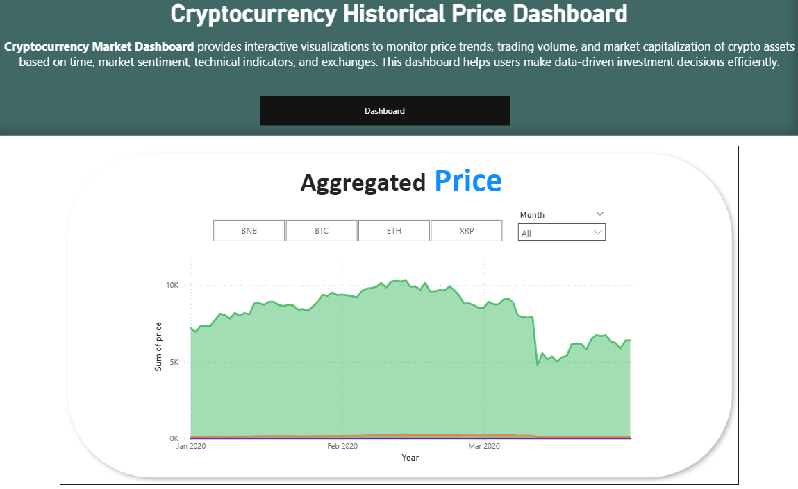
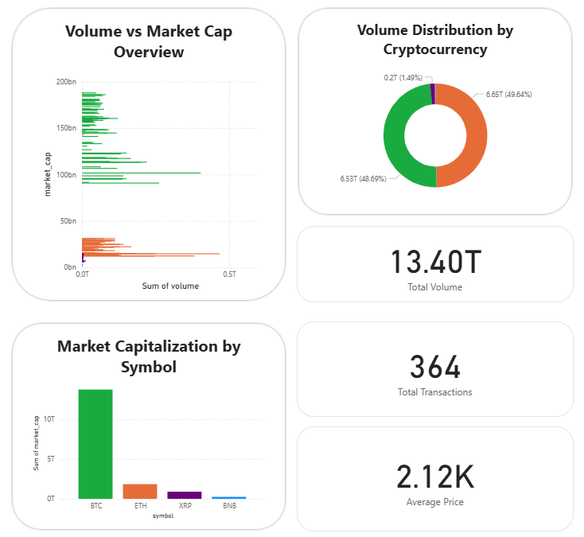

# Data Warehouse untuk Analisis Harga Historis Cryptocurrency

Repository ini adalah proyek Data Warehouse untuk analisis harga historis *cryptocurrency*. Proyek ini dirancang dan dikembangkan sebagai solusi terpusat untuk mengatasi tantangan analisis data di pasar aset kripto yang sangat volatil dan tersebar.

## Latar Belakang

Proyek Data Warehouse untuk Cryptocurrency Historical Price dirancang untuk mengatasi tantangan analisis data di pasar *cryptocurrency* yang sangat volatil, beragam, dan tersebar di banyak *exchange*. Dengan mengintegrasikan data harga, volume perdagangan, kapitalisasi pasar, dan sentimen pasar dari berbagai sumber ke dalam satu sistem terpusat, Data Warehouse ini memungkinkan analisis yang lebih efektif, akurat, dan mendalam. Hasilnya, investor dan analis dapat mengambil keputusan yang lebih baik, membuat prediksi yang lebih tepat, serta merancang strategi perdagangan yang lebih optimal di industri kripto.

## Tujuan & Target Proyek

Proyek ini bertujuan untuk mengembangkan sebuah Data Warehouse yang fungsional dengan target-target sebagai berikut:
- **Analisis Kebutuhan:** Menganalisis kebutuhan sistem Data Warehouse dalam konteks industri aset digital.
- **Desain Arsitektur:** Merancang arsitektur Data Warehouse (Star Schema) yang mampu mengintegrasikan data dari berbagai sumber.
- **Evaluasi Manfaat:** Mengevaluasi manfaat implementasi Data Warehouse dalam meningkatkan efisiensi analisis pasar.
- **Identifikasi Tantangan:** Mengidentifikasi tantangan dan solusi dalam penerapan Data Warehouse, termasuk kualitas data dan skalabilitas.
- **Visualisasi Hasil:** Menyajikan hasil analisis dalam bentuk visualisasi data yang informatif untuk memudahkan pemahaman terhadap tren pasar.

## Tech Stack

| Kategori | Teknologi |
| :--- | :--- |
| **Database** | SQL Server |
| **Proses ETL** | SQL Server Integration Services (SSIS) |
| **Manajemen Database** | SQL Server Management Studio (SSMS) |
| **Visualisasi Data** | Microsoft Power BI |
| **Scripting (ETL)** | C# |
| **Version Control** | Git & GitHub |

## Arsitektur Sistem

Arsitektur proyek ini mengikuti alur kerja Data Warehouse standar dari sumber hingga visualisasi:

**Sumber Data (Flat Files) ➔ Proses ETL (SSIS) ➔ Database Gudang Data (SQL Server) ➔ Visualisasi (Power BI)**

1.  **Sumber Data:** Data mentah bersumber dari berbagai file `.csv` yang berisi data historis harga, sentimen, dan informasi master lainnya.
2.  **ETL (SSIS):** Proses Extract, Transform, dan Load dilakukan menggunakan SSIS. Proses ini mencakup pembersihan data, konversi tipe data, kalkulasi metrik (seperti RSI & MA), dan pemuatan data ke dalam tabel dimensi dan fakta.
3.  **Gudang Data (SQL Server):** Data yang sudah bersih disimpan dalam database SQL Server dengan menggunakan desain **Star Schema** untuk optimalisasi query analitik.
4.  **Visualisasi (Power BI):** Hasil akhir dari data yang telah diolah disajikan dalam bentuk dashboard interaktif menggunakan Power BI untuk memudahkan analisis dan penarikan kesimpulan.

## Pratinjau Dashboard Visualisasi

Berikut adalah pratinjau dari dashboard utama yang dibuat menggunakan Power BI. Dashboard ini menyediakan visualisasi interaktif untuk memantau tren harga, volume perdagangan, kapitalisasi pasar, dan metrik kunci lainnya.

*Untuk melihat laporan Power BI secara lebih detail dan interaktif, silakan merujuk ke folder `/visualisasi`.*

**Tren Harga Agregat**

**Ringkasan Metrik & Analisis**

## Struktur Repository

Berikut adalah penjelasan singkat mengenai struktur folder dalam repository ini:
- **`/database`**: Berisi script SQL untuk membuat skema database, tabel, serta contoh query OLAP.
- **`/dataset`**: Berisi sampel data mentah dalam format `.csv` yang digunakan sebagai sumber untuk proses ETL.
- **`/docs`**: Berisi dokumentasi pendukung seperti diagram arsitektur atau ERD.
- **`/etl`**: Berisi dokumentasi detail untuk setiap langkah (Data Flow Task) dalam proses ETL di SSIS, lengkap dengan screenshot dan penjelasan logika.
- **`/script`**: Berisi kode C# yang digunakan dalam *Script Component* di SSIS untuk kalkulasi kustom.
- **`/visualisasi`**: Berisi file Power BI (`.pbix`) dan screenshot dari dashboard hasil akhir.

## Kontributor

Proyek ini merupakan hasil kerja sama tim yang terdiri dari:

| Nama | NPM |
| :--- | :--- |
| **Giast Ahmad** | 140810220018 |
| **Adnan Hafizh Sinatria** | 140810220048 |
| **Rio Irawan** | 140810220084 |