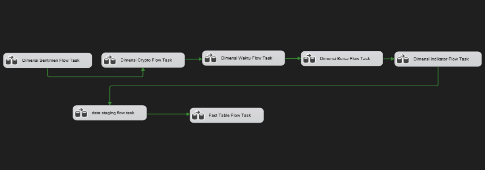

# Proses ETL (Extract, Transform, Load)

Dokumen ini adalah bagian dokumentasi untuk proses ETL (Extract, Transform, Load) dari proyek Data Warehouse ini. Seluruh proses ETL dirancang dan diimplementasikan menggunakan **SQL Server Integration Services (SSIS)**.

Tujuan utama dari proses ini adalah untuk mengekstrak data dari berbagai sumber file mentah (flat file), melakukan serangkaian transformasi data untuk membersihkan, memperkaya, dan menghitung metrik, lalu memuatnya ke dalam skema Data Warehouse (Star Schema) yang telah dirancang.

## Diagram Alur Kerja Kontrol (Control Flow)

Alur kerja di bawah ini menunjukkan urutan eksekusi dari setiap paket atau *task* utama dalam SSIS. Urutan ini berfungsi untuk menjaga integritas data, di mana tabel-tabel Dimensi harus dimuat terlebih dahulu sebelum akhirnya memuat Tabel Fakta.

Alur eksekusinya adalah sebagai berikut:
1.  **Pemuatan Dimensi:** Semua tabel dimensi dimuat terlebih dahulu. Proses ini dapat berjalan secara paralel.
2.  **Pemuatan Staging:** Tabel staging yang berisi data perantara disiapkan.
3.  **Pemuatan Fakta:** Setelah semua dimensi dan data staging siap, tabel fakta dimuat sebagai langkah terakhir.

## Rincian Detail Setiap Task

Setiap *task* yang ditampilkan dalam diagram di atas memiliki alur kerja data (Data Flow) yang spesifik dan kompleks. Berikut adalah tautan ke dokumentasi detail untuk setiap *task*:

### 1. Pemuatan Tabel Dimensi
* **[Dimensi Sentimen Pasar](./dimensi-sentimen-pasar/README.md)**: Memuat kategori sentimen dan sumbernya.
* **[Dimensi Cryptocurrency](./dimensi-cryptocurrency/README.md)**: Menggabungkan data dari beberapa sumber untuk membuat daftar crypto yang unik dan diperkaya.
* **[Dimensi Waktu](./dimensi-waktu/README.md)**: Memuat data kalender lengkap dari file `.csv`.
* **[Dimensi Bursa](./dimensi-bursa/README.md)**: Memuat daftar bursa (exchange) yang unik.
* **[Dimensi Indikator Teknikal](./dimensi-indikator-teknikal/README.md)**: Memuat kombinasi unik dari berbagai indikator teknikal.

### 2. Pemuatan Tabel Staging
* **[Staging Data](./staging/README.md)**: Memuat data mentah ke dalam tabel perantara (`staging_marketcap` & `staging_sentiment`) yang berjalan secara paralel.

### 3. Pemuatan Tabel Fakta
* **[Fact Table](./fact/README.md)**: Proses inti yang menggabungkan semua data, melakukan kalkulasi, dan memuat metrik utama ke dalam tabel fakta.

### 4. Script Tambahan
* **[Script Kalkulasi](./script/CalculateIndicators.cs)**: Berisi kode C# yang digunakan dalam *Script Component* di SSIS untuk menghitung metrik seperti RSI dan Moving Average.