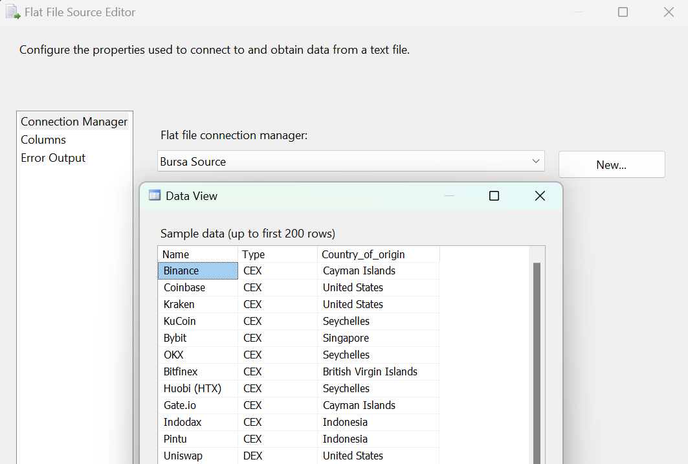
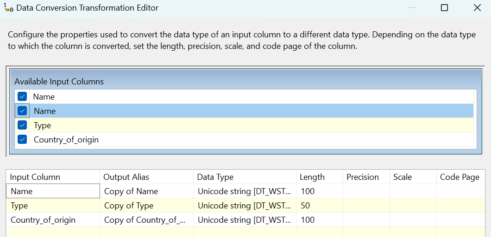
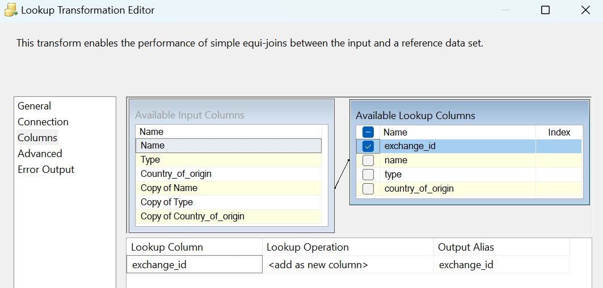
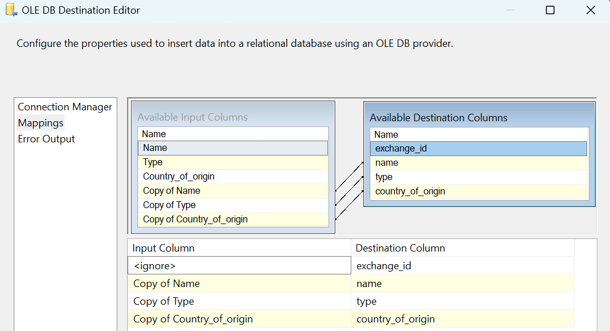

### **Data Flow - Dimensi Bursa**

**Tujuan:** Alur kerja ini bertujuan untuk memuat data untuk tabel `dimensi_bursa`. Proses ini membaca daftar bursa (exchange) dari sebuah file sumber, lalu menyaring dan memasukkan hanya bursa yang belum tercatat di dalam tabel tujuan untuk memastikan tidak ada data duplikat.

**Screenshot Alur Kerja:**

---

**Rincian Proses:**

#### 1. Bursa (Flat File Source)
* **Sumber:** Data diambil dari sebuah file csv yang berisi daftar nama bursa, tipe (CEX/DEX), dan negara asalnya.
* **Kolom:** Kolom yang dibaca adalah `Name`, `Type`, dan `Country_of_origin`.

#### 2. Data Conversion
Untuk menjaga integritas data dan kompatibilitas dengan database, tipe data dari sumber dikonversi.
* **Tujuan:** Mengubah semua kolom teks dari sumber menjadi format `Unicode string [DT_WSTR]`.

#### 3. Lookup
* **Tujuan:** Memeriksa apakah nama bursa dari file sumber sudah ada di dalam tabel `dbo.dimensi_bursa`.
* **Logika:**
    * Dilakukan pencarian (lookup) ke tabel tujuan dengan mencocokkan kolom `Name`.
    * Alur ini secara spesifik menggunakan output **`Lookup No Match Output`**. Hanya bursa yang **tidak ditemukan** di tabel tujuan yang akan dilanjutkan ke proses selanjutnya. Jika nama bursa sudah ada, maka baris data tersebut akan diabaikan.

#### 4. OLE DB Destination
Langkah terakhir adalah memasukkan data bursa yang benar-benar baru ke dalam tabel data warehouse.
* **Pemetaan (Mappings):**
    * Kolom-kolom yang sudah dikonversi (`Copy of Name`, `Copy of Type`, `Copy of Country_of_origin`) dipetakan ke kolom yang sesuai di tabel tujuan.
    * Kolom Primary Key `exchange_id` nilainya akan digenerate secara otomatis oleh database.

