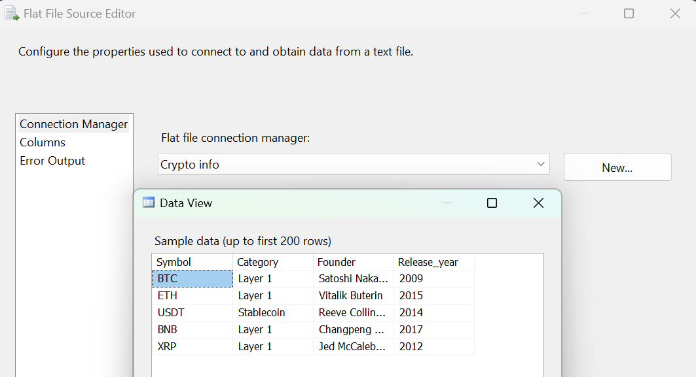

### **Data Flow - Dimensi Cryptocurrency**

**Tujuan:** Alur kerja ini memiliki tujuan membangun dan memuat anggota dimensi baru untuk `dimensi_cryptocurrency`. Proses ini menggabungkan dua jenis sumber data yang berbeda:
1.  **Data Transaksional:** Beberapa file harian yang berisi data harga untuk setiap *cryptocurrency*.
2.  **Data Master:** Satu file referensi yang berisi informasi umum tentang setiap *cryptocurrency* (seperti pendiri dan kategori).

Alur ini akan mengekstrak daftar unik *cryptocurrency* dari data transaksional, memperkayanya dengan data dari file master, lalu memeriksa apakah *cryptocurrency* tersebut sudah ada di tabel tujuan sebelum akhirnya memasukkan data yang benar-benar baru.

**Screenshot Alur Kerja:**

---

**Rincian Proses:**

Proses ini dapat dibagi menjadi tiga fase utama:

#### Fase 1: Pengumpulan & Deduplikasi Data Transaksional

Bagian atas dari alur kerja ini berfokus pada pengumpulan daftar unik *cryptocurrency* dari banyak file sumber.

* **1. Multi Flat File Source & Data Conversion:**
    * Proses dimulai dengan membaca beberapa file data historis (`BTC.csv`, `ETH.csv`, `BNB.csv`, dll). Setiap file mewakili data dari satu *cryptocurrency*.
    * Untuk setiap sumber, dilakukan **Data Conversion** pada kolom `Name` dan `Symbol` menjadi `Unicode string [DT_WSTR]` untuk konsistensi.

    
    

* **2. Union All:**
    * Semua data dari berbagai file sumber tersebut kemudian digabungkan menjadi satu alur data tunggal menggunakan transformasi **Union All**.

    

* **3. Aggregate (Deduplikasi):**
    * Untuk mendapatkan daftar unik *cryptocurrency*, transformasi **Aggregate** digunakan dengan operasi **Group by** pada `Copy of Name` dan `Copy of Symbol`.
    * Langkah ini secara efektif meniru fungsi `SELECT DISTINCT Name, Symbol`, menghasilkan satu baris untuk setiap *cryptocurrency* yang unik.

    

#### Fase 2: Penyiapan Data Master

Secara paralel, sebuah alur samping disiapkan untuk membaca data referensi (master).

* **1. Flat File Source & Data Conversion:**
    * Sebuah file `Crypto info.csv` yang berbeda dibaca. File ini berisi informasi tambahan seperti `Category`, `Founder`, dan `Release_year`.
    * **Data Conversion** dilakukan pada kolom-kolom ini untuk menyesuaikan tipe datanya dengan database tujuan.

    
    

#### Fase 3: Penggabungan, Lookup, dan Pemuatan

Di fase terakhir, kedua alur data dari Fase 1 dan 2 digabungkan dan diproses untuk dimuat ke tujuan.

* **1. Sort Transformation:**
    * Sebelum dapat digabungkan, kedua alur data (hasil dari *Aggregate* dan hasil dari *Data Conversion Info*) harus diurutkan (sort). Keduanya diurutkan berdasarkan kolom `Copy of Symbol` dalam urutan menaik (ascending). Langkah ini wajib agar transformasi **Merge Join** dapat berfungsi.

* **2. Merge Join:**
    * Kedua alur yang sudah diurutkan tersebut digabungkan menggunakan **Merge Join** dengan tipe `Inner Join`.
    * Kondisi join adalah pada kolom `Copy of Symbol`.
    * Hasilnya adalah sebuah alur data tunggal yang diperkaya, berisi `Name`, `Symbol`, `Category`, `Founder`, dan `Release_year`.

    

* **3. Lookup:**
    * Alur data yang sudah lengkap ini kemudian diperiksa terhadap tabel `dbo.dimensi_cryptocurrency` untuk menemukan data yang benar-benar baru.
    * Proses ini menggunakan **`Lookup No Match Output`**, yang artinya hanya *cryptocurrency* yang belum ada di tabel tujuan yang akan dilanjutkan.

    

* **4. OLE DB Destination:**
    * Baris-baris *cryptocurrency* yang baru ini dimasukkan ke tabel `dbo.dimensi_cryptocurrency`.
    * Pemetaan kolom dilakukan sesuai dengan data yang telah diperkaya. Kolom `crypto_id` diabaikan, karena nilainya dibuat secara otomatis oleh database.

    