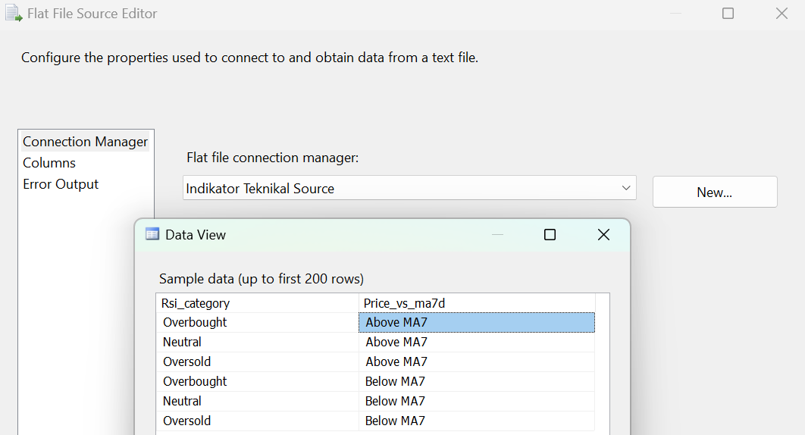
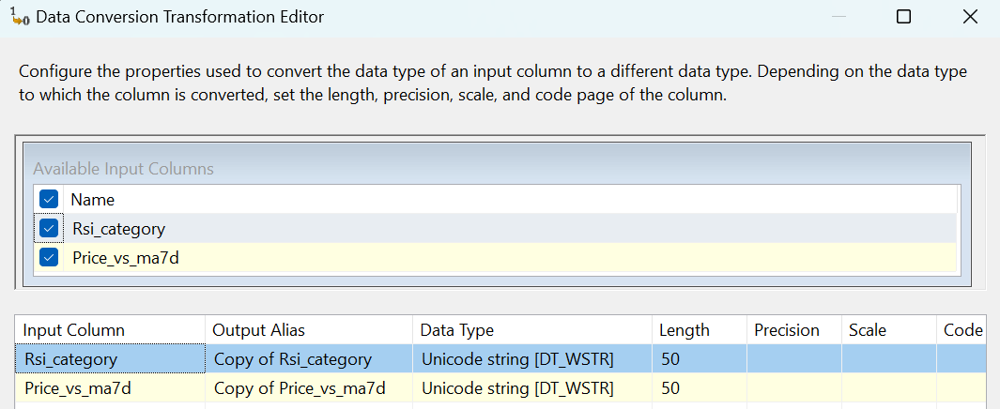
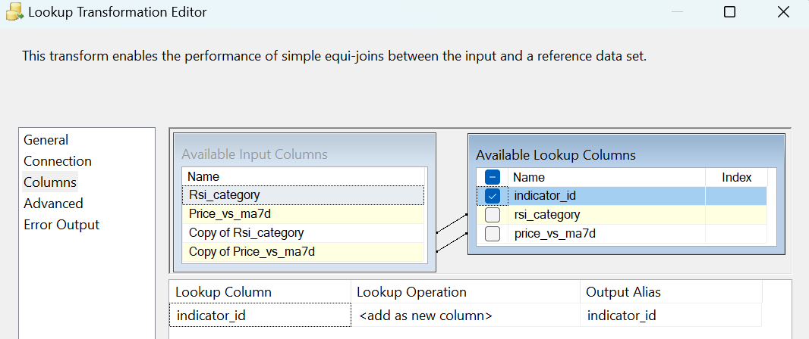
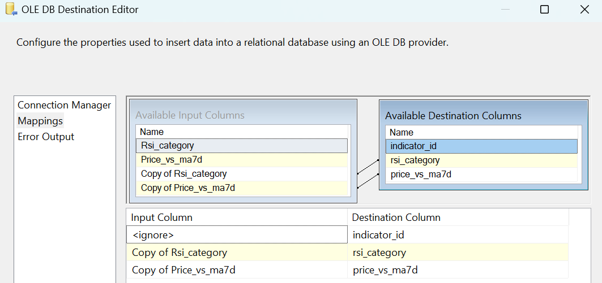

### **Data Flow - Dimensi Indikator Teknikal**

**Tujuan:** Alur kerja ini bertanggung jawab untuk memuat data untuk tabel `dimensi_indikator_teknikal`. Proses ini memastikan bahwa hanya kombinasi indikator yang unik dan belum pernah tercatat sebelumnya yang akan dimasukkan ke dalam tabel.

**Screenshot Alur Kerja:**

---

**Rincian Proses:**

#### 1. Indikator Teknikal (Flat File Source)
Proses dimulai dengan membaca semua kemungkinan kombinasi indikator dari file sumber.
* **Sumber:** Data diambil dari sebuah file `.csv` yang berisi semua permutasi dari kategori RSI dan posisi harga terhadap Moving Average 7 hari (MA7).
* **Kolom:** Kolom yang dibaca adalah `Rsi_category` dan `Price_vs_ma7d`.

#### 2. Data Conversion
* **Tujuan:** Mengubah kolom `Rsi_category` dan `Price_vs_ma7d` dari format teks menjadi `Unicode string [DT_WSTR]`.

#### 3. Lookup
* **Tujuan:** Memeriksa apakah **kombinasi** dari `Rsi_category` dan `Price_vs_ma7d` dari file sumber sudah ada di dalam tabel `dbo.dimensi_indikator_teknikal`.
* **Logika:**
    * Dilakukan pencarian (lookup) ke tabel tujuan dengan mencocokkan **kedua kolom secara bersamaan**.
    * Alur ini secara spesifik menggunakan output **`Lookup No Match Output`**. Hanya kombinasi indikator yang **tidak ditemukan** di tabel tujuan yang akan dilanjutkan.

#### 4. OLE DB Destination
* **Tujuan:** Memasukkan baris data baru ke dalam tabel `dbo.dimensi_indikator_teknikal`.
* **Pemetaan (Mappings):**
    * Kolom-kolom yang sudah dikonversi (`Copy of Rsi_category`, `Copy of Price_vs_ma7d`) dipetakan ke kolom yang sesuai di tabel tujuan.
    * Kolom Primary Key `indicator_id` akan digenerate secara otomatis oleh database.

