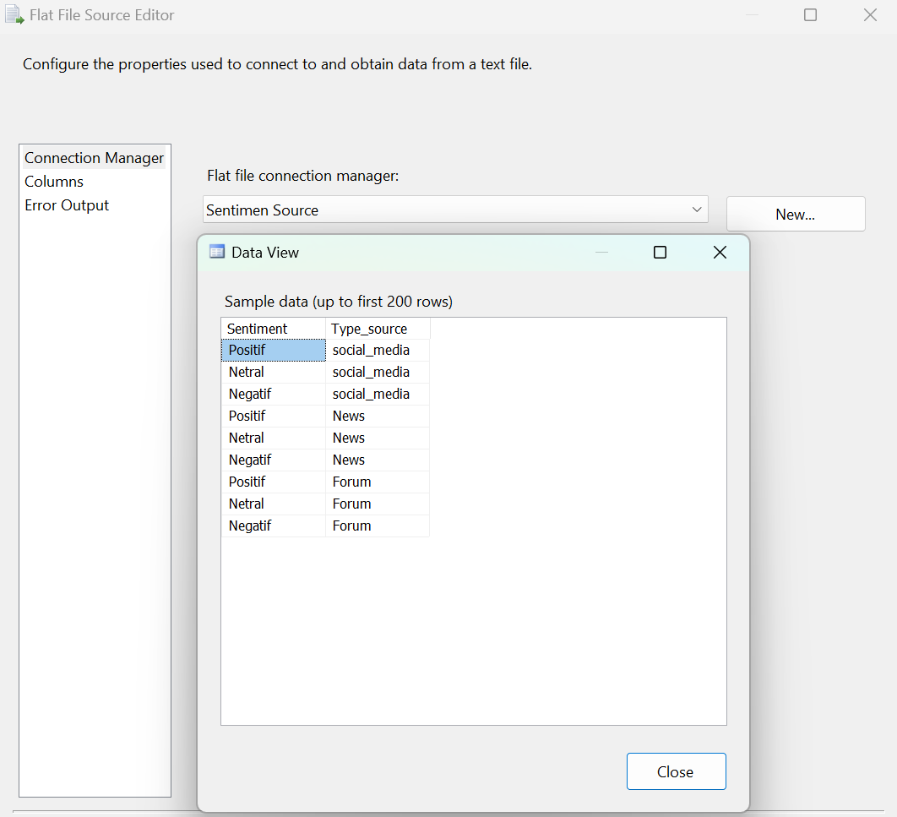
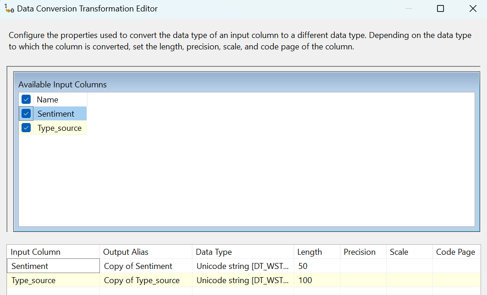
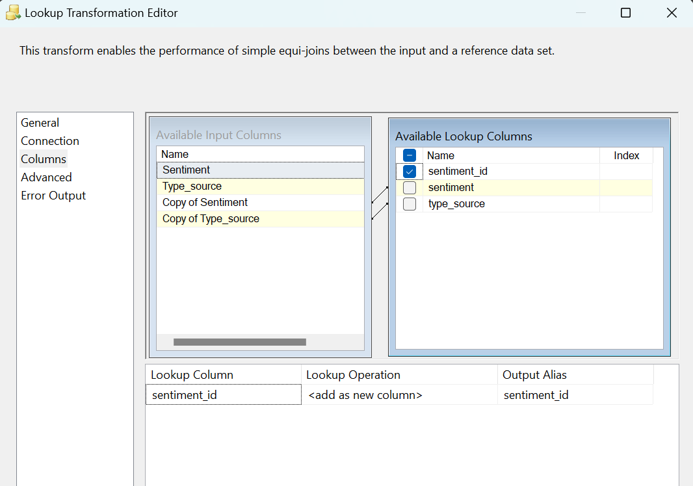
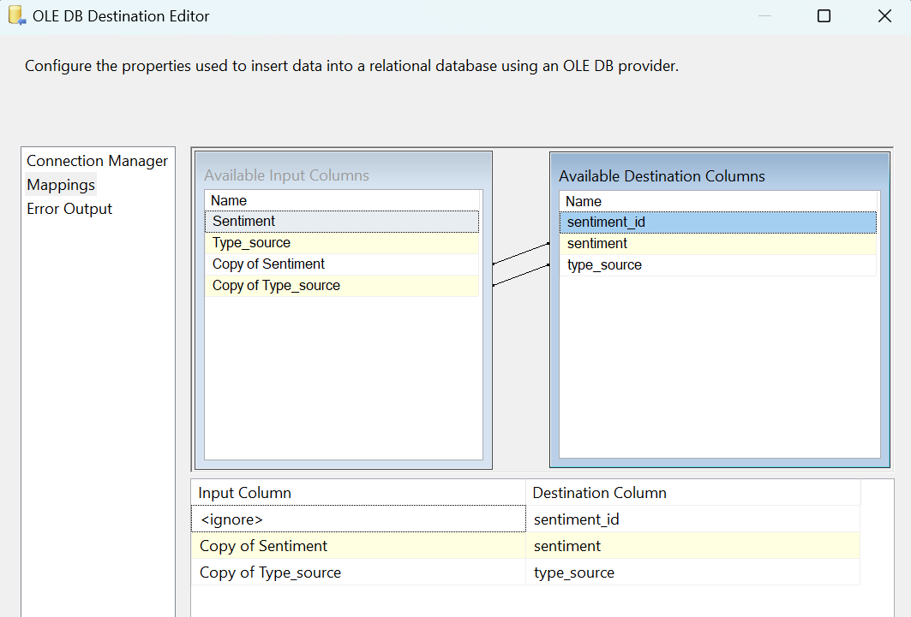

### **Data Flow - Dimensi Sentimen Pasar**

**Tujuan:** Alur kerja ini bertanggung jawab untuk memuat anggota dimensi (dimension members) yang baru untuk `dimensi_sentimen_pasar`. Proses ini membaca data sentimen dari file sumber, memeriksa apakah kombinasi sentimen dan sumbernya sudah ada di dalam tabel dimensi, dan jika **belum ada**, maka akan memasukkannya sebagai baris data baru.

**Screenshot Alur Kerja:**

---

**Rincian Proses:**

#### 1. Sentimen (Flat File Source)
Langkah pertama adalah membaca data mentah dari sumbernya.
* **Tipe:** `Flat File Source`
* **Sumber:** Data berasal dari file `.csv` yang berisi daftar sentimen dan tipe sumbernya.
* **Kolom:** Dua kolom utama dibaca dari sumber ini: `Sentiment` (contoh: 'Positif', 'Negatif') dan `Type_source` (contoh: 'social_media', 'News').

#### 2. Data Conversion
Sebelum data diproses lebih lanjut, tipe datanya disesuaikan untuk memastikan kompatibilitas dan mencegah error.
* **Tujuan:** Mengubah tipe data dari kolom `Sentiment` dan `Type_source` menjadi `Unicode string [DT_WSTR]`.

#### 3. Lookup
Pada langkah ini, kita memeriksa keberadaan data.
* **Tujuan:** Memeriksa apakah kombinasi `Sentiment` dan `Type_source` dari file sumber sudah ada di dalam tabel `dbo.dimensi_sentimen_pasar`.
* **Logika:**
    * Proses ini melakukan join antara data yang masuk dengan tabel `dimensi_sentimen_pasar` menggunakan kolom `Sentiment` dan `Type_source` sebagai kunci.
    * Yang terpenting, alur ini dikonfigurasi untuk hanya melanjutkan baris yang **tidak ditemukan** di tabel tujuan, dengan menggunakan output **`Lookup No Match Output`**.

#### 4. OLE DB Destination
Langkah terakhir adalah menyimpan data baru yang telah lolos dari proses Lookup ke dalam tabel dimensi.
* **Tujuan:** Memasukkan baris data baru ke dalam tabel `dbo.dimensi_sentimen_pasar`.
* **Pemetaan (Mappings):**
    * Kolom `Copy of Sentiment` dari alur data dipetakan ke kolom `sentiment` di tabel tujuan.
    * Kolom `Copy of Type_source` dipetakan ke kolom `type_source`.

