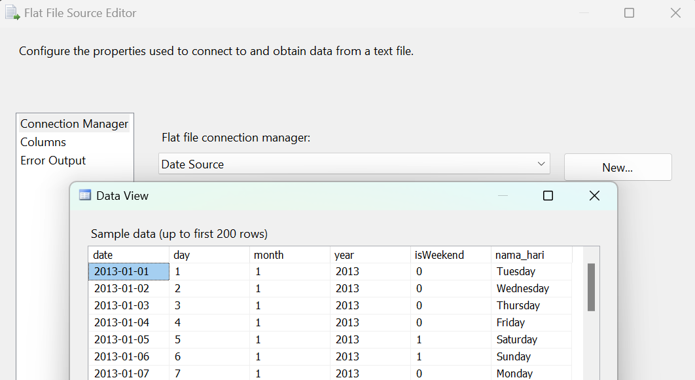
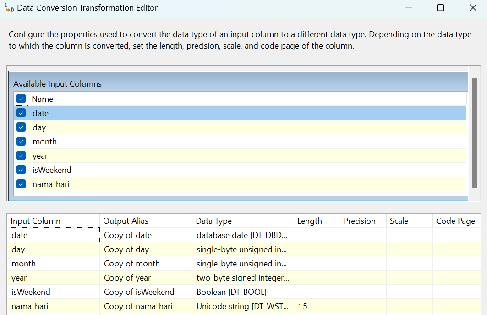
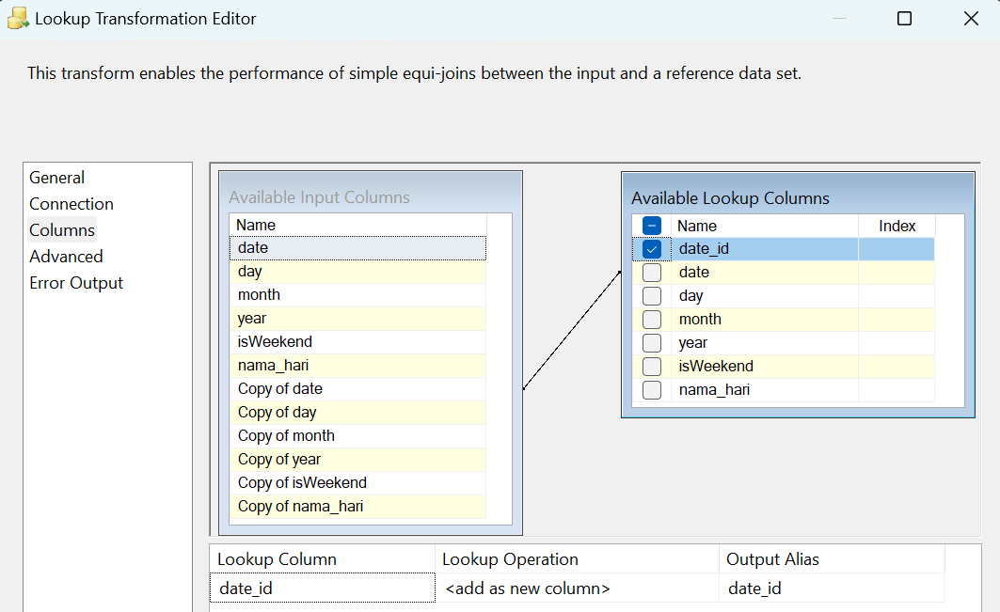
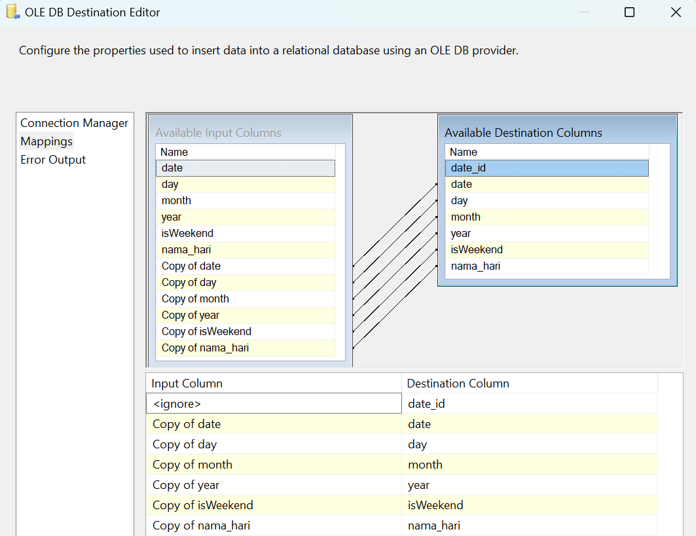

### **Data Flow - Dimensi Waktu**

**Tujuan:** Alur kerja ini bertanggung jawab untuk memuat data untuk tabel `dimensi_waktu`. Proses ini menggunakan file sumber yang sudah berisi atribut-atribut kalender lengkap (seperti nama hari, bulan, dan penanda akhir pekan). Logika utamanya adalah memastikan bahwa hanya tanggal yang belum ada di dalam tabel tujuan yang akan dimasukkan, sehingga mencegah adanya data duplikat.

**Screenshot Alur Kerja:**

---

**Rincian Proses:**

#### 1. Waktu (Flat File Source)
Proses dimulai dengan membaca data kalender yang sudah disiapkan sebelumnya.
* **Sumber:** Data berasal dari sebuah file teks yang berfungsi sebagai sumber utama untuk dimensi waktu. File ini berisi satu baris untuk setiap tanggal beserta atribut-atributnya.
* **Kolom:** Kolom yang dibaca antara lain `date`, `day`, `month`, `year`, `isWeekend`, dan `nama_hari`.

#### 2. Data Conversion
Langkah bertujuan untuk memastikan integritas dan tipe data yang benar sebelum dimuat ke database.

#### 3. Lookup
* **Tujuan:** Memeriksa apakah tanggal dari file sumber sudah ada di dalam tabel `dbo.dimensi_waktu`.
* **Logika:**
    * Dilakukan pencarian (lookup) ke tabel tujuan dengan mencocokkan kolom `date`.
    * Alur ini secara spesifik menggunakan **`Lookup No Match Output`**. Artinya, hanya baris data dengan tanggal yang **tidak ditemukan** di tabel tujuan yang akan diproses lebih lanjut. Jika sebuah tanggal sudah ada, data tersebut akan diabaikan.

#### 4. OLE DB Destination
Langkah terakhir adalah memuat data tanggal yang baru dan unik ke dalam tabel data warehouse.
* **Pemetaan (Mappings):**
    * Semua kolom yang telah dikonversi dari alur data (`Copy of date`, `Copy of day`, dll.) dipetakan ke kolom yang bersesuaian di tabel tujuan.
    * Kolom `date_id` akan di-generate secara otomatis oleh database.

