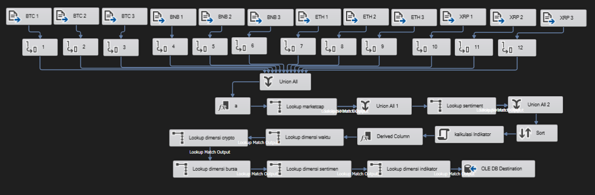
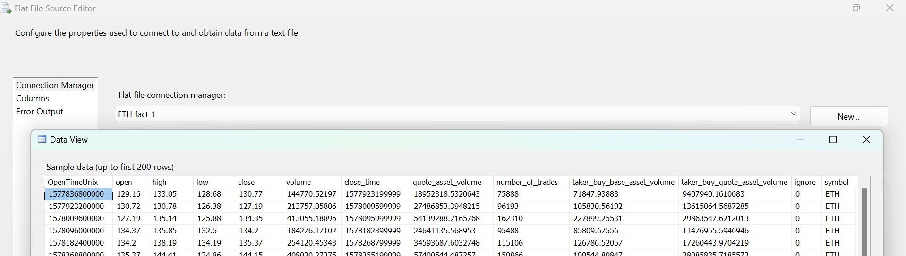
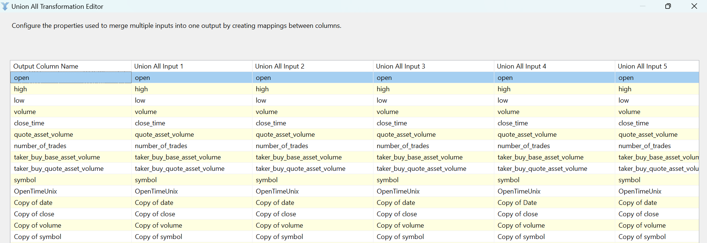
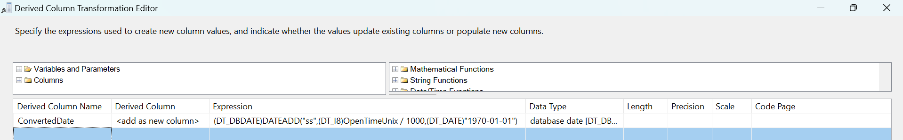
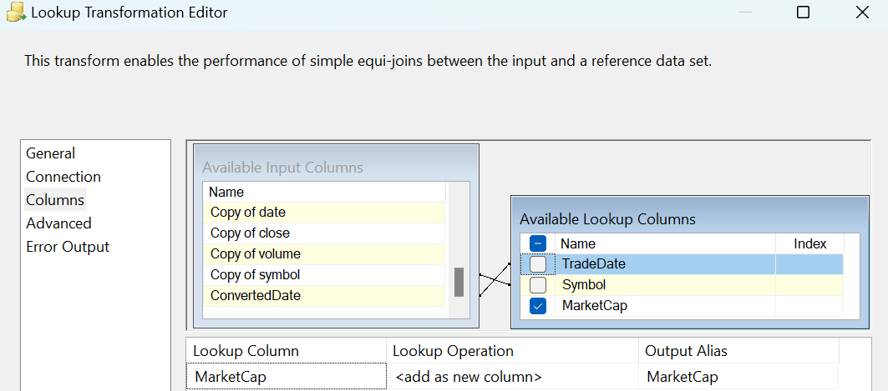
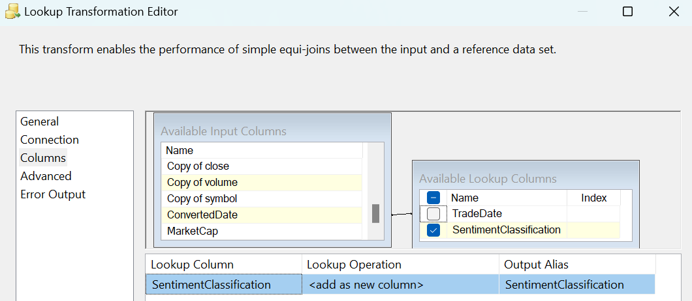
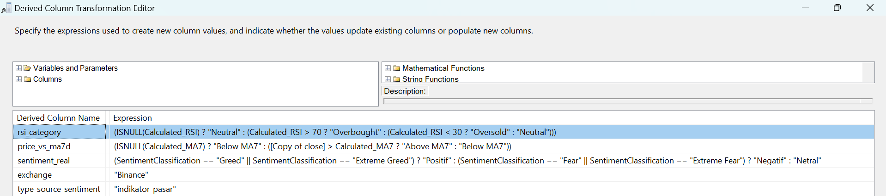
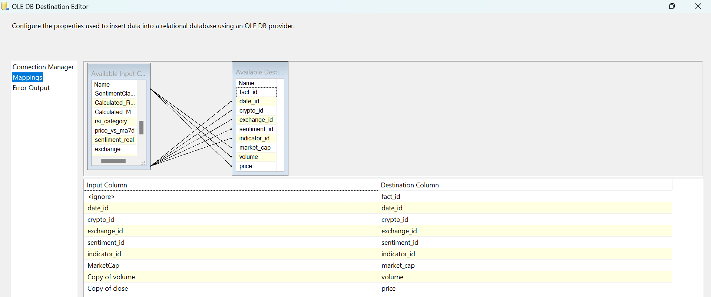

### **Data Flow - Fact Table**

**Tujuan:** Pada alur kerja ini semua data yang telah disiapkan sebelumnya digabungkan untuk membangun dan memuat `fact_table`. Proses ini mencakup beberapa tahapan:
1.  **Ingesti:** Menggabungkan data transaksional mentah dari berbagai file sumber.
2.  **Enrichment:** Memperkaya data mentah dengan informasi dari tabel-tabel staging (`staging_marketcap` dan `staging_sentiment`).
3.  **Kalkulasi:** Menghitung metrik dan kategori baru menggunakan Script Component dan Derived Column.
4.  **Resolusi Dimensi:** Mengganti kunci bisnis (seperti tanggal dan nama) dengan *surrogate key* (foreign key berupa `_id`) dari setiap tabel dimensi.
5.  **Pemuatan:** Memasukkan data yang sudah matang dan bersih ke dalam `fact_table`.

**Screenshot Alur Kerja:**

---

**Rincian Proses:**

Proses ini dapat dipecah menjadi lima fase utama yang berjalan secara berurutan:

#### Fase 1: Ingesti dan Unifikasi Data Mentah
Fase ini berfokus pada pengumpulan semua data transaksi harian dari berbagai sumber menjadi satu alur data.
* **1. Multi Flat File Source & Data Conversion:**
    * Membaca data mentah dari banyak file sumber (contoh: `BTC 1.csv`, `ETH 1.csv`, dll.).
    * Untuk setiap alur, dilakukan **Data Conversion** pada kolom-kolom penting seperti `OpenTimeUnix`, `close`, `volume`, dan `symbol`.
* **2. Union All:**
    * Semua alur data mentah dari berbagai file tersebut disatukan menjadi satu stream data besar menggunakan **Union All**.

#### Fase 2: Enrichment - Menambahkan Data dari Tabel Staging
Setelah data disatukan, data tersebut diperkaya dengan informasi yang telah disiapkan di tabel staging.
* **1. Derived Column (Konversi Waktu):**
    * `OpenTimeUnix` (dalam format Unix Timestamp) tidak bisa langsung digunakan untuk join. Sebuah kolom baru bernama `ConvertedDate` dibuat untuk mengonversi nilai Unix Timestamp menjadi format `datetime` standar.
* **2. Lookup Marketcap:**
    * Menggunakan `ConvertedDate` dan `symbol`, dilakukan lookup ke tabel `staging_marketcap` untuk mengambil data `MarketCap` yang sesuai.
* **3. Lookup Sentiment:**
    * Menggunakan `ConvertedDate`, dilakukan lookup ke tabel `staging_sentiment` untuk mengambil `SentimentClassification` (contoh: 'Extreme Greed', 'Fear').

#### Fase 3: Kalkulasi Logika Bisnis (Derived Column & Script Component)
Pada tahap ini data diolah menjadi informasi yang lebih bermakna.
* **1. Script Component:**
    * Sebuah **Script Component** digunakan untuk melakukan perhitungan kompleks yang tidak dapat ditangani oleh komponen SSIS standar. Script ini menghitung nilai **RSI** dan **Moving Average 7 Hari (MA7)** untuk setiap baris data.
    * **Catatan:** Kode untuk script ini dapat dilihat di file [berikut](../script/CalculateIndicators.cs).
* **2. Derived Column (Kategorisasi):**
    * Berdasarkan hasil dari Script Component dan data yang sudah ada, beberapa kolom turunan baru dibuat untuk tujuan analisis dan lookup ke dimensi:
        * `rsi_category`: Mengklasifikasikan nilai RSI (misal: `< 30` menjadi 'Oversold').
        * `price_vs_ma7d`: Membandingkan harga penutupan (`close`) dengan nilai MA7.
        * `sentiment_real`: Menyederhanakan klasifikasi sentimen (misal: 'Extreme Greed' dan 'Greed' menjadi 'Positif').
        * `exchange`: Memberi nilai konstan 'Binance' karena sumber data untuk saat ini hanya berasal dari sana.
        * `type_source_sentiment`: Memberi nilai konstan 'indikator pasar'. Nilai ini digunakan karena sumber data sentimen (Fear & Greed Index) tidak cocok dengan kategori lain yang ada. Untuk pengembangan saat ini, metode untuk mengambil data sentimen dari sumber lain (seperti News atau Social Media) belum diimplementasikan, sehingga semua sentimen dikategorikan sebagai 'indikator pasar'.

#### Fase 4: Lookup Dimensi - Penggantian Kunci Surrogate
Pada fase ini, semua nilai bisnis yang sudah dihitung diganti dengan `foreign key` dari tabel dimensi masing-masing.
* **Lookup Dimensi Waktu:** Mencocokkan `ConvertedDate` untuk mendapatkan `date_id`.
* **Lookup Dimensi Cryptocurrency:** Mencocokkan `Copy of symbol` untuk mendapatkan `crypto_id`.
* **Lookup Dimensi Bursa:** Mencocokkan kolom `exchange` yang dibuat di fase 3 untuk mendapatkan `exchange_id`.
* **Lookup Dimensi Sentimen:** Mencocokkan kombinasi `sentiment_real` dan `type_source_sentiment` untuk mendapatkan `sentiment_id`.
* **Lookup Dimensi Indikator:** Mencocokkan kombinasi `rsi_category` dan `price_vs_ma7d` untuk mendapatkan `indicator_id`.

#### Fase 5: Pemuatan Final ke Fact Table
Setelah semua transformasi dan lookup selesai, data siap dimuat.
* **Tujuan:** Memasukkan baris data yang bersih dan lengkap ke dalam `dbo.fact_table`.
* **Pemetaan (Mappings):**
    * Semua kolom `_id` yang didapat dari lookup, beserta metrik utama (`MarketCap`, `volume`, `price`), dipetakan ke kolom yang sesuai di tabel tujuan.
    * Kolom Primary Key `fact_id` nilainya dibuat secara otomatis oleh database.

