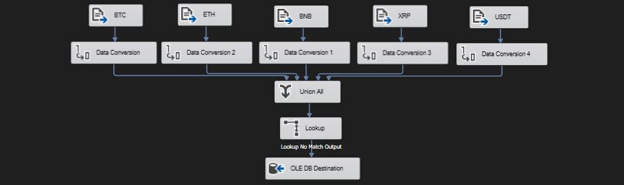
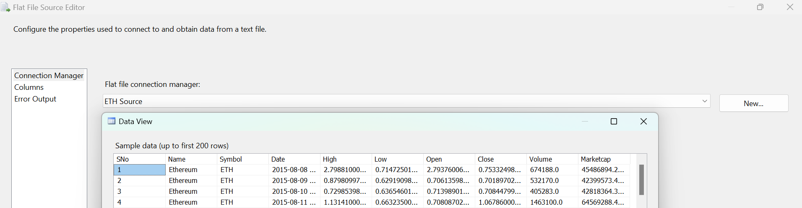
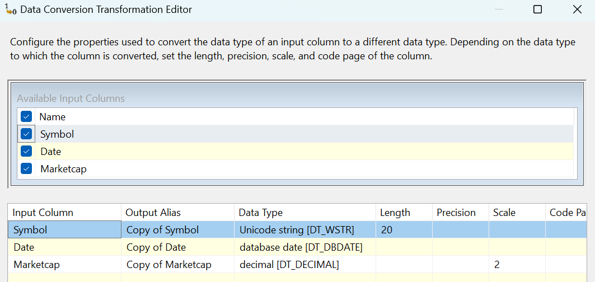
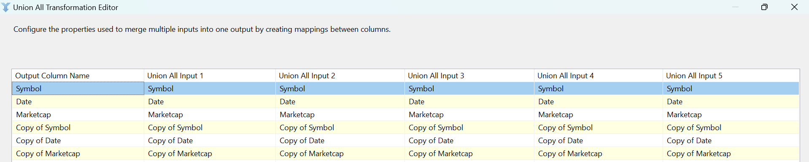
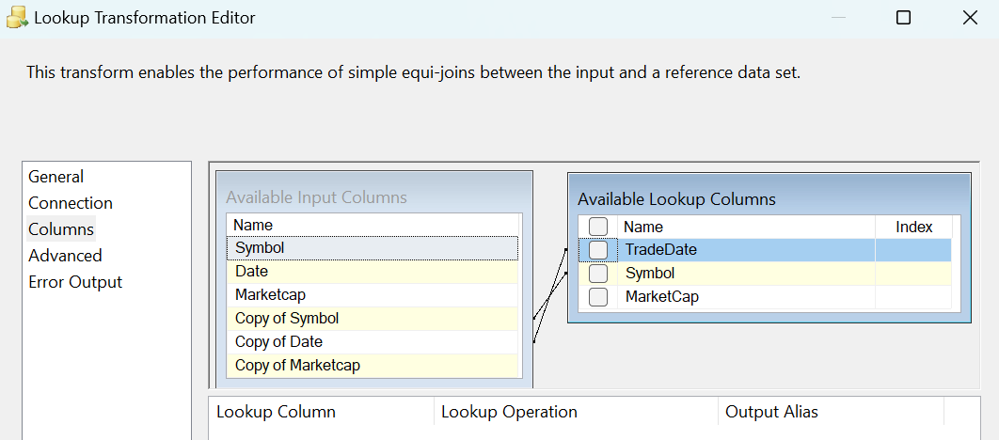
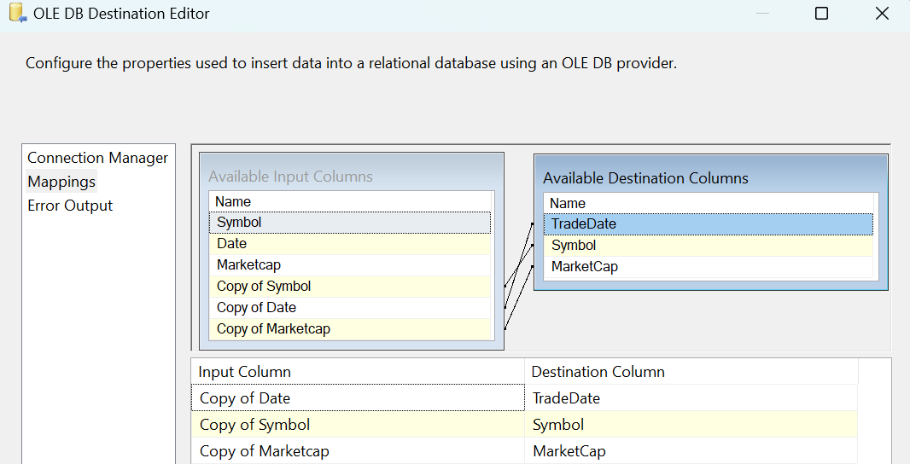
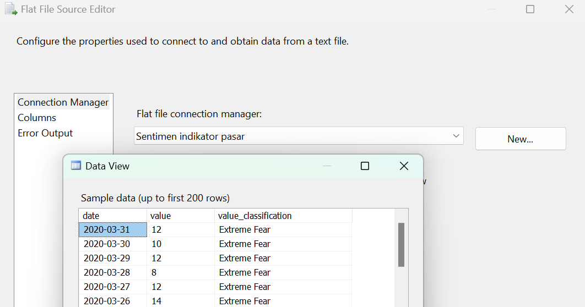
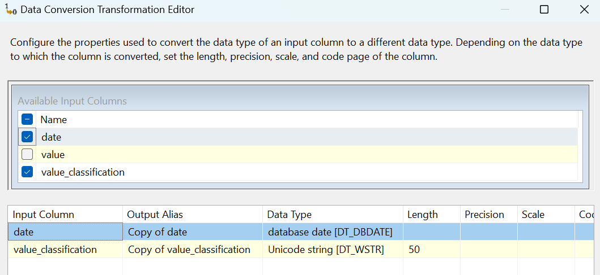
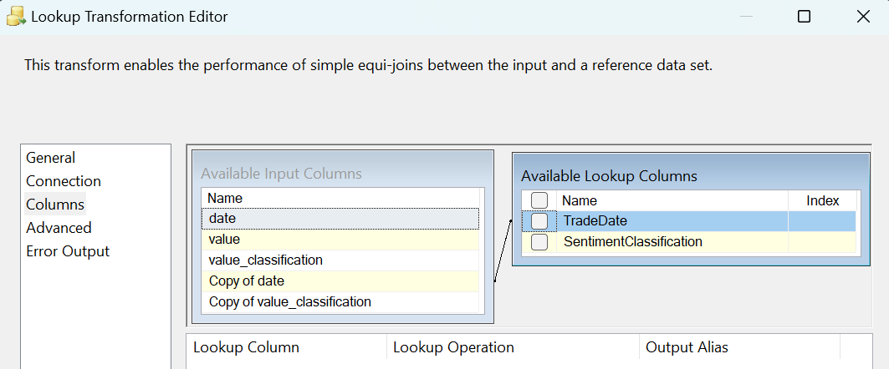
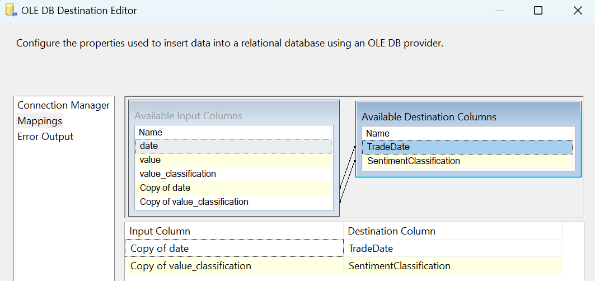

### **Data Flow - Tabel Staging**

**Tujuan:** Dua proses pemuatan data ke tabel staging yang berbeda dijalankan secara **paralel** dalam satu Data Flow Task. Tujuannya adalah untuk mengisi dua tabel perantara:
1.  `staging_marketcap`: Menampung data kapitalisasi pasar harian untuk beberapa *cryptocurrency*.
2.  `staging_sentiment`: Menampung data klasifikasi sentimen pasar harian.

Kedua proses ini berjalan independen dan dirancang untuk hanya memuat data baru yang belum ada di tabel staging masing-masing.

---

### **Alur 1: Memuat `staging_marketcap`**

Alur ini berfokus pada pengumpulan data historis dari berbagai file crypto dan memuatnya ke tabel `staging_marketcap`.

**Screenshot Alur Kerja:**

**Rincian Proses:**

* **1. Multi Flat File Source & Data Conversion:**
    * Proses dimulai dengan membaca beberapa file data historis (`BTC.csv`, `ETH.csv`, dll.).
    * Untuk setiap sumber, dilakukan **Data Conversion** pada kolom `Symbol`, `Date`, dan `Marketcap` ke tipe data yang sesuai (`string`, `date`, `decimal`).

    
    

* **2. Union All:**
    * Data dari semua sumber file tersebut digabungkan menjadi satu alur tunggal menggunakan **Union All**.

    

* **3. Lookup:**
    * Dilakukan pengecekan ke tabel `dbo.staging_marketcap` untuk mencegah duplikasi.
    * Lookup menggunakan **kunci komposit** (dua kolom): `Symbol` dan `Date`.
    * Alur ini menggunakan **`Lookup No Match Output`**, sehingga hanya baris dengan kombinasi `Symbol` dan `Date` yang belum ada yang akan diproses lebih lanjut.

    

* **4. OLE DB Destination:**
    * Data baru yang unik (berdasarkan `Symbol` dan `Date`) dimasukkan ke dalam tabel `dbo.staging_marketcap`.
    * Kolom `Copy of Date`, `Copy of Symbol`, dan `Copy of Marketcap` dipetakan ke kolom tujuan yang sesuai.

    

---

### **Alur 2: Memuat `staging_sentiment`**

Berjalan secara paralel, alur ini memuat data sentimen harian ke dalam tabel `staging_sentiment`.

**Screenshot Alur Kerja:**

**Rincian Proses:**

* **1. Flat File Source & Data Conversion:**
    * Proses membaca data dari satu file sumber `Crypto Fear & Greed Index API dari Alternative.me` yang sudah dikonversi menjadi `.csv`.
    * **Data Conversion** dilakukan untuk mengubah kolom `date` menjadi tipe data `date` dan `value_classification` menjadi `Unicode string`.

    
    

* **2. Lookup:**
    * Dilakukan pengecekan ke tabel `dbo.staging_sentiment` untuk menghindari data duplikat.
    * Lookup menggunakan `date` sebagai kunci pencarian.
    * Proses ini menggunakan **`Lookup No Match Output`** untuk memastikan hanya data dari tanggal yang belum ada yang akan dimuat.

    

* **3. OLE DB Destination:**
    * Data sentimen harian yang baru dimasukkan ke dalam tabel `dbo.staging_sentiment`.
    * Kolom `Copy of date` dipetakan ke `TradeDate` dan `Copy of value_classification` dipetakan ke `SentimentClassification`.

    